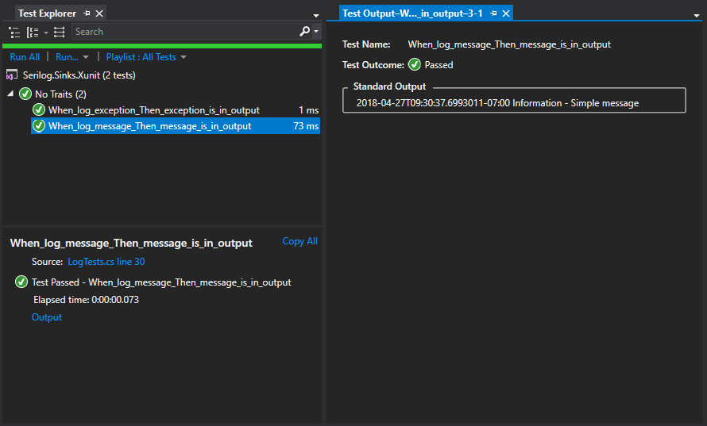

# Introduction 
A Serilog sink that writes log events to the [Xunit](https://xunit.github.io/) [test output](https://xunit.github.io/docs/capturing-output). 

# Getting Started
To use the sink, first install the NuGet package:
```powershell
Install-Package Serilog.Sinks.Xunit2
```
Or
```bash
dotnet add package Serilog.Sinks.Xunit2
```

Then enable the sink using `WriteTo.Xunit(output)`:
```csharp
using Serilog;
using Xunit;
using Xunit.Abstractions;

public class SampleTest
{
    public SampleTest(ITestOutputHelper output)
    {
        Log.Logger = new LoggerConfiguration()
            .WriteTo.Xunit(output)
            .CreateLogger();
    }

    [Fact]
    public void DoSomeTest()
    {
        // Arrange
        // Act
        // Assert
        Log.Information("Hello, world!");
    }
}
```

Log events will be printed to the Xunit test output:


# Build and Test
Clone this repo:
```bash
git clone https://github.com/yorchideas/Serilog.Sinks.Xunit2.git
```

Change directory to repo root:
```bash
cd Serilog.Sinks.Xunit
```

Build the solution:
```bash
dotnet restore
dotnet build
```

This will result in the following:
* Restore all NuGet packages required for building
* Build all projects. Final binaries are placed into `<repo_root>\build\bin\<Configuration>`

To run unit tests, execute:
```bash
dotnet test ./test/Serilog.Sinks.Xunit.UnitTests/Serilog.Sinks.Xunit.UnitTests.csproj
```

# Licences
This project is licensed under the MIT license.